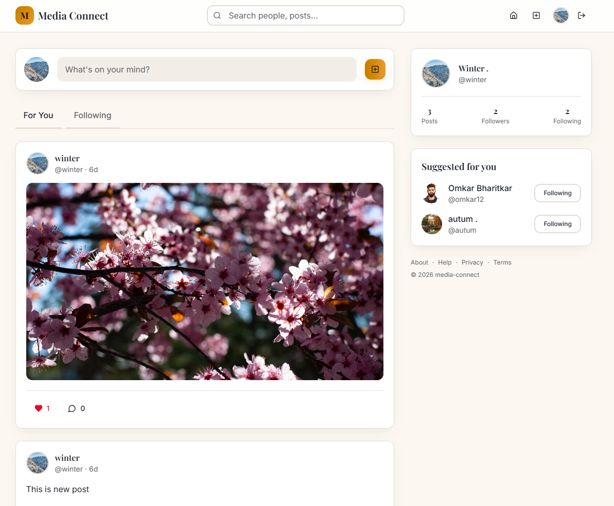

# Media-Connect 

Media-Connect is a modern, full-stack social media application built using the MERN stack (MongoDB, Express, React, Node.js). It allows users to connect with friends, share media, and interact with content in a seamless and responsive environment.

## 🚀 Live Demo

**View the hosted project here:** [Media-Connect Website](https://media-connect-social.vercel.app/)

## ℹ️ Images

## ✨ Key Features

*   **User Authentication:** Secure login and registration utilizing JSON Web Tokens (JWT) and bcrypt for password hashing.
*   **User Profiles:** Create, edit, and customize your personal profile. Follow and unfollow other users.
*   **Media Sharing:** Create posts with text and images. Images are securely uploaded and managed via Cloudinary.
*   **Social Interactions:** Like and comment on posts to engage with the community.
*   **Responsive Design:** A beautiful, fully responsive UI built with Tailwind CSS and Radix UI components, ensuring a great experience across all devices.
*   **Real-time Updates:** Optimized data fetching and state management using React Query on the frontend.

## 🛠️ Tech Stack

**Frontend:**
*   React 19 (via Vite)
*   Tailwind CSS (v4)
*   Radix UI Primitives
*   React Router DOM
*   TanStack React Query
*   Axios for API requests
*   React Hook Form
*   Sonner for toast notifications

**Backend:**
*   Node.js & Express.js
*   MongoDB & Mongoose
*   Cloudinary (Image Storage)
*   Multer (File Uploads)
*   JSON Web Tokens (JWT)
*   Bcrypt.js

## 📁 Project Structure

*   **/client**: Contains the React frontend application.
*   **/server**: Contains the Express backend API and database models.

---
*Built with ❤️ by Shantanu*
